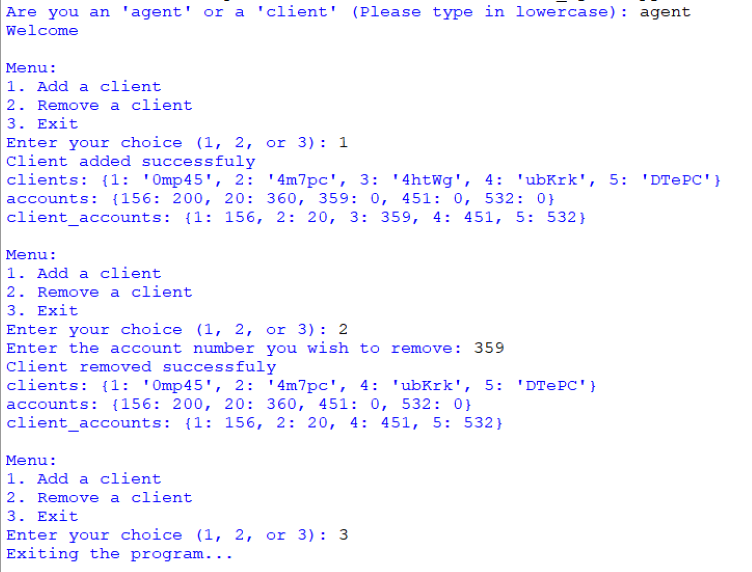
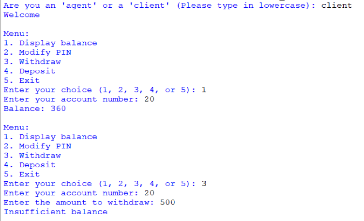
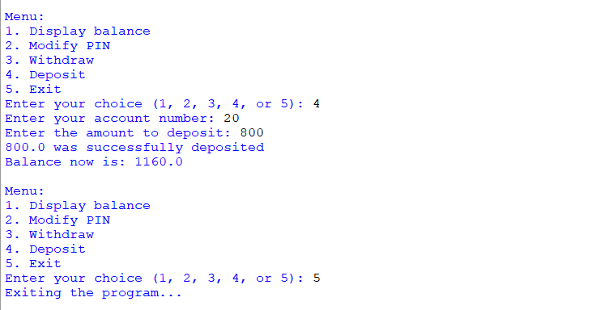

## Description
A Python program implementing a banking system that includes functionalities for agents (adding/removing clients) and clients (checking balance, withdrawing, depositing, modifying PIN). The system utilizes JSON files to store client and account data, ensuring persistent data storage between program runs.
## Screenshots
♡ **Agent**

♡ **Client**  

